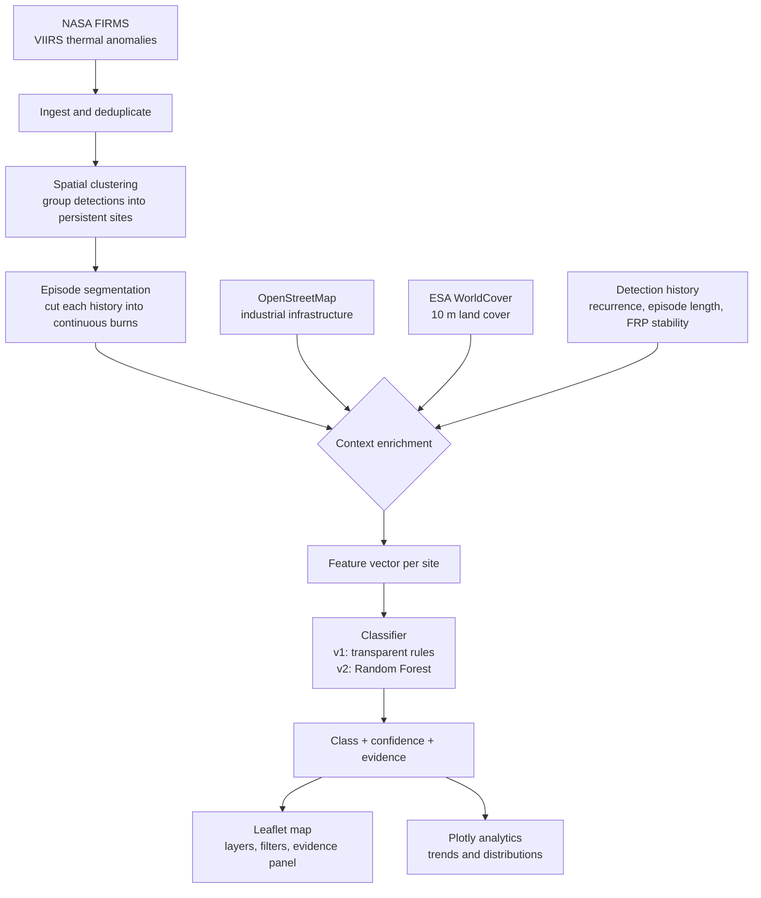
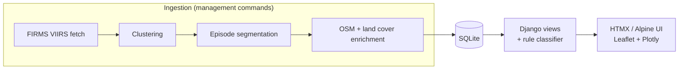
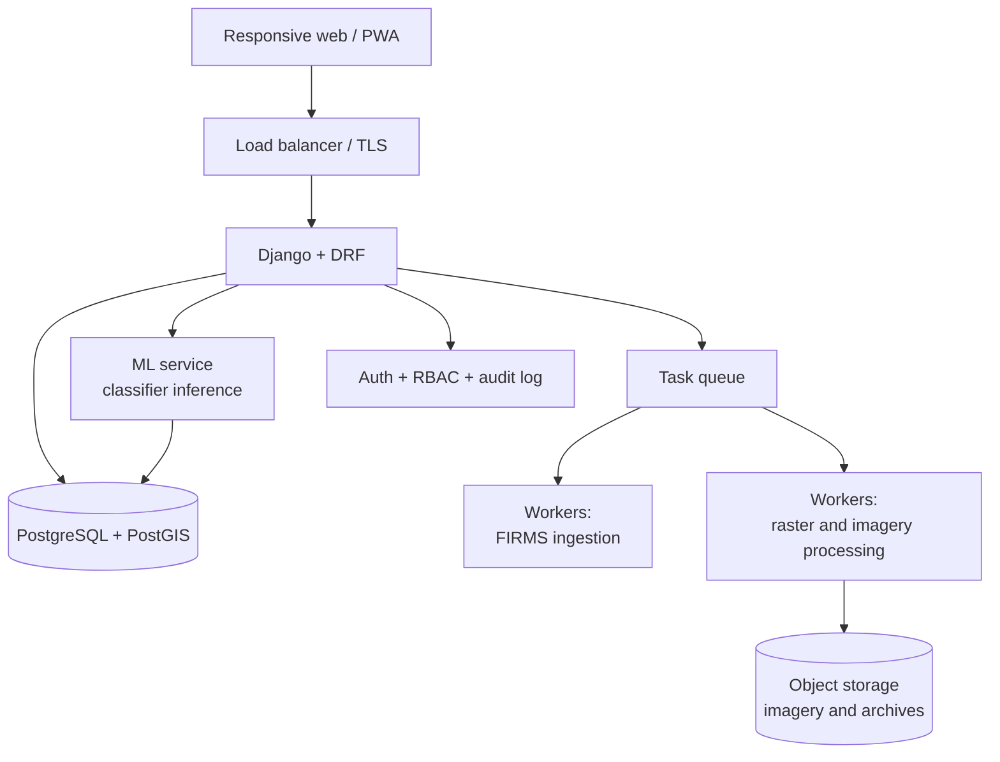

# AgniDrishti

**AI-assisted geospatial detection and classification of industrial fires and persistent thermal anomalies.**


> Satellites already tell us *where* the Earth is hot. They do not tell us *why*.
> AgniDrishti is the layer that answers the second question.

| | |
|---|---|
| **Problem Statement ID** | 26162 |
| **Title** | AI-Based Detection and Classification of Industrial Fires and Persistent Thermal Sources Using NASA FIRMS, OSM & Satellite Data |
| **Organisation** | National Technical Research Organisation (NTRO) |
| **Theme** | Disaster Management |
| **Team** | AsyncMavericks_SIH26162 |

---

## Table of contents


- [The problem](#the-problem)
- [What AgniDrishti does](#what-agnidrishti-does)
- [Why the existing approaches fail](#why-the-existing-approaches-fail)
- [Study region and validation scope](#study-region-and-validation-scope)
- [How it works](#how-it-works)
- [Classification logic (v1)](#classification-logic-v1)
- [What the system outputs](#what-the-system-outputs)
- [Feature set](#feature-set)
- [Data sources](#data-sources)
- [Map layers](#map-layers)
- [Technology stack](#technology-stack)
- [Implementation status](#implementation-status)
- [Architecture](#architecture)
- [Getting started](#getting-started)
- [Project structure](#project-structure)
- [Roadmap](#roadmap)
- [Security](#security)
- [Known limitations](#known-limitations)
- [Team](#team)
- [Data attribution and licensing](#data-attribution-and-licensing)

---

## The problem

NASA's FIRMS service publishes near-real-time **thermal anomalies** detected by the MODIS and VIIRS
instruments. Every few hours, a fresh set of hot pixels appears over India.

A thermal anomaly is not a fire alert. The same signal is produced by:

- an actual industrial accident inside a chemical plant,
- a refinery gas flare that has burned continuously for fifteen years,
- post-harvest crop residue burning in the field next door,
- a smouldering municipal landfill,
- a brick kiln, a steel furnace, or a sun-heated metal roof.

For an authority monitoring an industrial corridor, this is close to unusable. The persistent
sources fire the same alert every single day, and genuine incidents are buried inside that noise.
The information gap is not detection — **it is interpretation.**

## What AgniDrishti does

AgniDrishti ingests thermal anomalies, enriches each one with geospatial context, and assigns it to
one of four classes, together with the evidence behind that decision:

| Class | Meaning | Typical signature |
|---|---|---|
| 🔴 **Industrial fire** | A probable unplanned fire event on industrial land | High FRP, industrial land cover, **low** historical recurrence |
| 🟠 **Persistent thermal source** | Routine, continuous industrial heat — flares, furnaces, kilns | Stable FRP, industrial land cover, **high** recurrence at the same location |
| 🟢 **Vegetation fire** | Crop residue, forest, grassland or scrub burning | Vegetated/cropland land cover, away from industrial infrastructure |
| ⚪ **Other / uncertain** | Signal present, context insufficient or contradictory | Low confidence, conflicting features, landfill/unmapped sites |

Outputs are delivered through an interactive map with filtering, per-hotspot evidence panels, and
time-series analytics.

**The core design principle:** every classification is shown together with the features that produced
it. A user never sees a bare label. They see *"Persistent thermal source — detected on 84 of the last
90 days, 210 m from a mapped refinery, on built-up land cover, FRP stable at 38 ± 6 MW."*

## Why the existing approaches fail

This section exists because the obvious solutions are the wrong ones, and knowing why shaped the
entire design.

**1. "Just show the FIRMS hotspots on a map."**
Large refinery complexes produce detections almost every day. So does every flare stack in the
corridor. An operator receiving those alerts stops reading alerts within a week. Raw display without
classification actively destroys the value of the data.

**2. "Label a hotspot as industrial if it is near a factory."**
This is circular. If proximity to industry decides the label, and proximity to industry is also the
model's input, the model has learned nothing — it has memorised a rule we wrote ourselves, and its
reported accuracy is meaningless. It also produces confident, wrong answers in exactly the cases
that matter: a crop fire 600 m from a GIDC estate boundary, or a landfill fire adjacent to an
industrial zone.

> **In AgniDrishti, distance to industrial infrastructure is a feature. It is never a label.**
> Labels come from contextual verification using satellite imagery and map evidence.

**3. "Classify each detection on its own."**
An industrial fire and a routine gas flare look nearly identical in a single snapshot — both are hot,
both sit on built-up land, both are near a factory. The signal that separates them is **temporal**:
a flare recurs at the same coordinates for months with stable radiative power; a fire is an anomaly
against that baseline. AgniDrishti therefore models each location's history, not just each detection.

## Study region and validation scope

We deliberately separate **where the system runs** from **where it has been verified**. Conflating
the two is how projects end up claiming coverage they cannot defend.

### Ingestion scope — the state of Gujarat

```
INGEST_BBOX = 68.9, 20.0, 73.5, 23.6      # lon_min, lat_min, lon_max, lat_max
```

The pipeline ingests and classifies thermal anomalies across the whole state. Enrichment runs once
at ingest time and is stored on each record, so region size does not affect query performance.

### Validation corridor — Hazira to Ankleshwar

```
VALIDATION_BBOX = 72.4, 21.0, 73.2, 22.0   # approx. 83 km x 111 km
```

Our labelled dataset, our annotation queue and our reported accuracy metrics are concentrated in
this corridor — Hazira, Surat, Dahej, Bharuch and Ankleshwar. It was chosen because it contains all
four target classes within a single map view:

- **Persistent thermal sources** — petrochemical flaring at Hazira and Dahej.
- **Industrial fire risk** — the chemical estates of the "Golden Corridor": Ankleshwar, Vapi, Vatva.
- **Vegetation fires** — the surrounding cropland and scrub.
- **Other / confounders** — municipal landfill sites and brick kilns, the classic source of false
  industrial-fire alarms.

Concentrating a limited labelling budget produces dense, defensible ground truth. Spreading the same
number of labels across the whole state would give a handful of examples per industrial cluster and
confidence in none of them. **With a small sample, depth beats breadth.**

The bounding boxes are configuration values. Widening either one is a config change, not a redesign.

## How it works



**Step by step:**

1. **Ingest** — pull FIRMS VIIRS detections for the ingestion bounding box, near-real-time plus a
   rolling 90-day archive.
2. **Cluster** — group detections falling within a small radius into a single persistent *site*, so
   that history accumulates per location rather than per pixel.
3. **Segment** — cut each site's history into *episodes*: runs of detections bounded by quiet gaps.
   This is what separates one sustained burn from several unrelated short ones at the same place.
4. **Enrich** — for each site, compute distance to the nearest mapped industrial feature (OSM), read
   the land cover class beneath it (ESA WorldCover), and derive temporal statistics from its history.
5. **Classify** — apply the rule set below, producing a class, a confidence score, and the list of
   features that drove it.
6. **Visualise** — render on an interactive map with supporting charts.

### Data model — three tables

The schema is the argument. Each table exists because the one below it cannot answer a question the
system needs answered.

| Table | One row is | Why it exists |
|---|---|---|
| `Detection` | One thermal anomaly reported by FIRMS at one instant | The raw observation |
| `Event` | One continuous burning episode at a location | A site's counters cannot distinguish *when* its detection days fell |
| `Site` | A location that has produced detections over time | A single detection cannot separate a flare from an accident |

**Why `Event` is not optional.** A site that burns for three days in March and two days in May
records `recurrence_days = 5` — the same value as one unbroken five-day burn, and the same value as
five scattered single days across three months. Three entirely different situations, compressed into
one number. That information is destroyed during feature extraction, which means **no classifier can
recover it, however good the model.** Episodes preserve the arrangement:

```
Site #2 · Hazira
├─ Event 1   21 Jun → 27 Jun    7-day span,  6 days active   (density 0.86)
│            ← 11 days quiet →
└─ Event 2   08 Jul → 18 Sep   73-day span, 42 days active   (density 0.58)  ongoing
```

Episodes are cut wherever a site falls quiet for longer than `EVENT_GAP_DAYS` (default 10). The
threshold is deliberately generous: FIRMS cannot see through cloud, and Gujarat's monsoon covers most
of our observation window, so a continuously-operating furnace goes dark for days at a time. At a
7-day threshold the Hazira steel plant already fragments into three episodes. **A quiet gap is
evidence of absence only when it is long.**

Events are rebuilt from scratch on every ingest rather than appended to, which keeps the pipeline
idempotent: late-arriving detections can close a gap that previously split one burn in two.

## Classification logic (v1)

**Version 1 uses a documented, transparent rule set, not a machine learning model.** This is a
deliberate choice, and we state it openly rather than describing an untrained model as if it were
working.

The rules encode our domain hypothesis *explicitly*. Their purpose is threefold: to make the
prototype demonstrable end-to-end, to expose the hypothesis to criticism, and to pre-label candidates
in the annotation interface so that human reviewers **correct** rather than label from scratch —
which is how we intend to reach a usable training set efficiently.

| Priority | Rule | Assigned class |
|---|---|---|
| 1 | VIIRS confidence is `low` | Other / uncertain |
| 2 | ≤ 1 km from industrial feature **and** land cover ∈ {Built-up, Bare} **and** *either* recurrence ≥ persistent threshold *or* longest episode ≥ persistent threshold with density ≥ 0.25 | Persistent thermal source |
| 3 | ≤ 1 km from industrial feature **and** land cover ∈ {Built-up, Bare} **and** peak FRP ≥ 10 MW **and** recurrence ≤ episodic threshold | Industrial fire |
| 4 | Land cover ∈ {Tree cover, Shrubland, Grassland, Cropland} | Vegetation fire |
| 5 | None of the above | Other / uncertain |

**Thresholds are relative to the observation window.** "Detected on 20 days" means something
entirely different over a 90-day archive than over a 7-day feed, so they are held as fractions of the
window (20/90 and 3/90) with floors that stop a short window producing statistically meaningless
rules. Over 90 days they reproduce the documented 20 and 3 days exactly. Rule 2's episode threshold
reuses the same persistent value, measured as a span rather than a day count.

**Three design decisions in these rules are worth stating explicitly**, because the obvious
alternatives are wrong — and in two cases were what we built first.

*Rule 2 no longer requires stable radiative power.* An earlier version demanded FRP coefficient of
variation below 0.5, on the assumption that a flare burns steadily. Measured over 90 days that turns
out to be false, and backwards: median CV *rises* with recurrence (0.32 for episodic sites, 0.69 for
near-daily ones), because a site observed more often is sampled across more viewing angles,
atmospheres and times of day. The gate was rejecting precisely the most persistent sources — every
one of the ten most recurrent sites failed it, and the class came back empty. CV is still reported
and still shapes confidence, but it no longer decides the class.

*Rule 2 has two independent routes in, because cloud breaks recurrence but not span.* A location can
show that it burns routinely either by being detected on many days across the window, or by burning
within one long continuous run. Site #43 near Hazira burned inside a **41-day stretch** and is still
burning, yet reached a recurrence of only 15 — below the threshold of 20 — because monsoon cloud
suppressed the detections in between. The recurrence test alone abstained on it. A 41-day run is not
an accident. The density floor guards this route: a 20-day span holding two detections is two blips
three weeks apart, not a sustained burn. Sites admitted by episode length alone are capped at medium
confidence and carry a distinct `matched_rule`, so they stay separable in the annotation queue.

*Rule 4 lets land cover lead.* An earlier version also required the site to be more than a kilometre
from mapped industry, which denied the vegetation label to 18 of 106 sites burning on cropland merely
because a factory stood nearby. A hot pixel on cropland is cropland burning, whatever sits next door.
Proximity now lowers confidence and is recorded in the evidence instead of silently overriding the
land cover.

These thresholds are **initial estimates, not validated science.** No accuracy figure is claimed for
them, because no labelled test set exists yet. Their role is to be replaced: in v2, a Random Forest
learns these boundaries from labelled data instead of having them hard-coded by us.

The classifier sits behind a single interface, so swapping the implementation does not touch the
rest of the system:

```python
class Classifier(Protocol):
    def predict(self, features: SiteFeatures) -> Classification: ...
```

## What the system outputs

Each classified site produces one record, surfaced in the map's evidence panel:

```
Site #2 · 21.1066° N, 72.6469° E
Class:        Persistent thermal source   (confidence: high)
Evidence:     recurs on 48 of 90 days (53% of the observed period)
              longest continuous episode: 73 days, with detections on 58% of them
              the current episode has not yet ended
              FRP averages 6.9 MW (coefficient of variation 0.88)
              489 m from nearest mapped industrial feature
              nearest feature type: metals heavy
              land context: bare

Episodes:     21 Jun → 27 Jun    7d span,  6d active
              ── 11 days quiet ──
              08 Jul → 18 Sep   73d span, 42d active   [open]
```

That is a verbatim record from the current build, not an illustration. The episode strip is rendered
in the evidence panel as proportional bars across the observed window, with opacity tracking density
— so a sparse run looks faint, which is how much it should be trusted.

**An important distinction about industry type.** The model predicts *one of four classes* and
nothing else. The industry type shown above is **retrieved from OpenStreetMap, not predicted** — it
is the tag on the nearest mapped feature, displayed as supporting context.

AgniDrishti does not identify what kind of facility is burning. It reports what is mapped nearby.
We are explicit about this because the difference between a prediction and a database lookup is
exactly the kind of claim that should not be blurred.

## Feature set

The same feature vector feeds the v1 rules and the planned v2 model.

| Feature | Source | Rationale |
|---|---|---|
| `frp_mean`, `frp_max` | FIRMS | Fire Radiative Power (MW) — energy release rate |
| `frp_cv` | Derived | Stability of radiative power across the site's detections |
| `brightness_max` | FIRMS | Peak brightness temperature (K), VIIRS I-4 channel |
| `confidence` | FIRMS | Best detection reliability seen — VIIRS reports low / nominal / high |
| `night_fraction` | FIRMS | Share of detections at night; industrial heat is time-invariant, most crop burning is not |
| `detection_count` | Derived | Total observations at this location |
| `recurrence_days` | Derived | Distinct days with a detection inside the window — the classic discriminator |
| `site_age_days` | Derived | First to last detection; a source active for years is not an accident |
| `dist_industrial_m` | OSM | Distance to nearest industrial feature — **a feature, not a label** |
| `industrial_group` | OSM | Coarse category of the nearest feature (see below) |
| `land_context` | ESA WorldCover | 10 m land cover beneath the detection, OSM land-use as fallback |
| `event_count` | Derived | Number of distinct burning episodes |
| `max_event_duration` | Derived | Longest continuous episode, in days — see below |
| `longest_episode_density` | Derived | Detection days ÷ span of that episode; separates a sustained burn from scattered blips |
| `mean_gap_days` | Derived | Average quiet interval between episodes |
| `has_ongoing_event` | Derived | An episode here is not yet closed by a quiet gap — the field an alert query filters on |

**Why the episode features earn their place, and why `event_count` alone does not.** Measured across
all 556 sites in the current build, `event_count` averages 2.83 for confirmed persistent sources
against 1.07 for vegetation fires — heavily overlapping, and the Hazira steel plant scores the same
3 as a site with four stray detections. `max_event_duration` averages **48.2 days against 1.9**, with
a median of 49 against 1. Arrangement is informative; the count of episodes is not, on its own.

**Industrial groups.** OpenStreetMap carries dozens of industrial tags. With a few hundred training
examples, a high-cardinality categorical fragments into splits too thin to learn from, so tags are
collapsed into six groups:

`petro_chemical` · `power_generation` · `metals_heavy` · `light_manufacturing` · `waste_landfill` · `extraction_kiln`

**Why there are no calendar features.** Seasonality is genuinely informative for vegetation fires —
but only across multiple annual cycles. Our labelled set will be collected over a short window, so a
`month` feature would correlate almost perfectly with our sampling period. A Random Forest would
split on it, score well in validation by memorising *when we collected data*, and fail on anything
new. Calendar features are deferred until the dataset spans at least one full year. Land cover and
recurrence already carry the signal that matters.

## Data sources

| Source | What we use it for | Resolution / cadence | Status |
|---|---|---|---|
| **NASA FIRMS — VIIRS** | Thermal anomaly detections — the primary input | 375 m; NRT within ~3 h of overpass | **v1** |
| *NASA FIRMS — MODIS* | *Additional detections via multi-sensor fusion* | *1 km* | *Planned* |
| **OpenStreetMap** | Industrial infrastructure: `landuse=industrial`, `man_made=works`, `man_made=flare`, `power=plant`, `landuse=landfill`, `landuse=quarry` | Vector, community-maintained | **v1** |
| **ESA WorldCover** | Land cover beneath and around each detection | 10 m, 11 classes | **v1** |
| **Sentinel-2 MSI** | Visual verification during dataset labelling, performed manually via Copernicus Browser | 10–60 m, ~5-day revisit | **v1 (labelling workflow)** |
| *Sentinel-2 in-app layer* | *Date-matched, cloud-free composite tiles served inside the application* | | *Planned* |
| *Sentinel-1 SAR* | *Cloud-penetrating structural change detection* | *10–40 m* | *Planned* |

**Two ways in to FIRMS.** The keyed Area API reaches a 90-day archive but needs a free
`MAP_KEY`. NASA also publishes open regional standard products covering a rolling 7-day window with
no key at all, and the pipeline falls back to those automatically when no key is configured. All
three VIIRS platforms — Suomi-NPP, NOAA-20 and NOAA-21 — are pulled and merged, since they cross at
different local times and together give materially more observations per day.

**Why VIIRS only in v1.** MODIS reports confidence as a 0–100 integer while VIIRS uses
low/nominal/high, and the two instruments have very different footprints (1 km vs 375 m), so
supporting both means normalising two confidence schemes and deduplicating across mismatched
pixel geometries. VIIRS alone offers finer resolution and more detections. MODIS is added later as a
fusion step rather than as a special case threaded through the ingestion code.

**Why the Sentinel-2 in-app layer is deferred.** Sentinel-2 is not published as ready-made web map
tiles. Serving it means downloading scenes, building cloud-free composites — a raw monsoon-season
scene over Gujarat is mostly cloud — generating and hosting tiles, and matching acquisitions to
detection timestamps. None of that improves classification. Sentinel-2 is therefore used where it
adds real value today: **verifying labels by eye during dataset construction.**

## Map layers

Leaflet is used as a **provider-agnostic rendering layer**, which means base maps are a
configuration choice rather than an architectural commitment.

| Layer | Purpose | Notes |
|---|---|---|
| Esri World Street Map | Default base map, street and industrial context | Free, no key, attribution required |
| Esri World Light Gray | Muted base map that lets classified hotspots dominate | Free, no key |
| Esri World Imagery | Satellite view — see the actual facility beneath a hotspot | Free, no key, attribution required |
| ISRO Bhuvan (planned) | Indian geospatial reference layers via WMS | Adds an Indian authoritative source |
| Industrial infrastructure | OSM industrial features as an overlay | Derived from our own cached extract |
| Classified hotspots | Colour-coded by class, with clustering at low zoom | The primary layer |
| District choropleth | Detection counts aggregated per district | BharatViz boundary GeoJSON, styled with our own data |

### Two views of the same data

A point map answers *"what is burning at this location?"* It does not answer *"which districts
warrant attention this month?"* — and for a disaster-management audience, the second question is
often the operational one.

AgniDrishti therefore offers a **district-level choropleth view** alongside the point layer. District
and state boundaries come from [BharatViz](https://github.com/saketlab/bharatviz), an MIT-licensed
open-source project that publishes GeoJSON boundary sets for 750+ Indian districts and 36 states. We
load those boundaries into Leaflet as a `L.geoJSON` overlay and colour each district using our own
aggregated detection counts:

```javascript
fetch('/static/geo/districts.geojson')
  .then(r => r.json())
  .then(geo => L.geoJSON(geo, {
      style: f => ({
        fillColor: colourScale(counts[f.properties.district] || 0),
        weight: 1, color: '#666', fillOpacity: 0.65
      })
  }).addTo(map));
```

This keeps a single rendering stack — Leaflet draws both the markers and the choropleth, and the two
layers toggle independently. Using published boundary data rather than digitising our own also means
our district geometries match the sets used in Indian government and census reporting.

BharatViz's hosted web application additionally exports publication-quality SVG and PNG choropleths
from a CSV, which is useful for producing static figures for reports without writing plotting code.

**A note on basemap providers, since two obvious choices do not work.**
`openstreetmap.org`'s own tile servers are volunteer-funded and explicitly *not* an
application CDN — their usage policy deprecates the `{s}` subdomains and the servers
returned HTTP 403 "Access blocked" tiles in testing. CARTO served tiles successfully but
stamped "API KEY REQUIRED" across every one of them. Esri's ArcGIS Online services serve
street, light and satellite basemaps without a key or registration, requiring only
attribution, so all three basemaps are sourced from there. OpenStreetMap remains the source
of our *industrial infrastructure data* via Overpass — that is a separate service with
different, and far lighter, load characteristics.

We are not adopting a single-vendor map SDK. Commercial Indian map APIs can be consumed through
their raster tile endpoints as an additional Leaflet layer if required, but binding the application
to a keyed, quota-limited external service would introduce a live failure mode during operation for
no analytical gain.

## Technology stack

| Layer | Choice | Why this and not something else |
|---|---|---|
| Backend | **Django 5** | Batteries-included auth, ORM, admin and RBAC — all of which we need and none of which we want to build |
| Interactivity | **HTMX + Alpine.js** | Server-rendered partials give us a responsive UI without a separate SPA build pipeline and API surface. A React rewrite would add complexity without adding capability at this scale |
| Styling | **Tailwind CSS** | Rapid, consistent UI without maintaining a bespoke stylesheet |
| Database | **SQLite** (prototype) → **PostgreSQL + PostGIS** | SQLite is sufficient for a bounded demo dataset. PostGIS becomes necessary once spatial joins and nearest-neighbour queries run over large archives — that migration is planned, not hypothetical |
| Geospatial processing | **Shapely, Rasterio** | R-tree indexes for vector lookups; windowed reads of remote Cloud Optimized GeoTIFFs for land cover. GeoPandas is deliberately not used — it would pull in GDAL for operations these two already cover |
| ML | **scikit-learn** (Random Forest) | Tabular features, small dataset, and — critically — inspectable feature importance. A deep network here would be less accurate *and* less explainable |
| Maps | **Leaflet** | Lightweight and provider-agnostic: OSM, satellite imagery and Bhuvan WMS layers coexist without vendor lock-in |
| Charts | **Plotly** | Interactive time-series and distribution analysis |
| Boundaries | **BharatViz GeoJSON** | MIT-licensed Indian district and state boundary sets, rendered as a Leaflet choropleth layer |
| API (planned) | **Django REST Framework** | Needed only when a second client exists; deferred until then |

## Implementation status

<!-- Update this table as each item lands. Do not mark anything ✅ until it demonstrably runs. -->

**Legend:** ✅ Implemented · 🔨 In progress · 📋 Planned

| Capability | Status | Notes |
|---|---|---|
| FIRMS VIIRS ingestion | ✅ | Open regional feeds (7-day) and keyed API (90-day), deduplicated |
| Spatial clustering into persistent sites | ✅ | 0.005° grid; enables recurrence features |
| Episode segmentation into burning events | ✅ | Gap-bounded runs; 663 episodes across 556 sites |
| OSM industrial layer and distance features | ✅ | 3,595 features cached for Gujarat |
| ESA WorldCover land cover lookup | ✅ | 10 m, read remotely from Cloud Optimized GeoTIFFs |
| Rule-based classifier (v1) | ✅ | Window-relative thresholds, documented above |
| Interactive Leaflet map with layers and filters | ✅ | Class, FRP, recurrence, confidence |
| Per-site evidence panel | ✅ | Shows the features behind each label, plus an episode strip |
| Plotly analytics dashboard | ✅ | Class distribution, detections/day, recurrence spread |
| District choropleth layer | 📋 | BharatViz boundaries + aggregated counts |
| Historical playback over time | 📋 | |
| Manual annotation interface | 📋 | Pre-labelled by v1 rules, corrected by reviewers |
| Labelled training dataset (target: 300–500 verified sites) | 📋 | Corridor-scoped; quality and class balance over volume |
| Event-level classification | 📋 | Labels currently sit on `Site`; moving them to `Event` lets two fires months apart be judged separately |
| Random Forest classifier (v2) | 📋 | Replaces v1 rules behind the same interface |
| Model evaluation on a held-out test set | 📋 | No accuracy will be claimed before this exists |
| MODIS fusion | 📋 | Multi-sensor detection merging |
| Sentinel-2 in-app imagery layer | 📋 | Cloud-free composites |
| Alerting and notification rules | 📋 | |
| PostgreSQL + PostGIS migration | 📋 | Triggered by dataset size, not by preference |
| Authentication and role-based access | 📋 | Admin / operator / viewer |

## Architecture

### Current prototype



### Target production architecture

Designed so that the AI and geospatial pipeline is **not rewritten** when the system scales — only
its surroundings change.



> We are using a lightweight deployment approach for rapid prototyping and demonstration, while
> designing the architecture so that it can later scale into a production system. **The prototype
> itself is not production-scale, and we do not claim that it is.**

## Getting started

> These instructions describe the prototype. Steps for components still marked 📋 above will become
> available as those components land.

### Prerequisites

- Python 3.11+
- Optionally, a free [NASA FIRMS MAP_KEY](https://firms.modaps.eosdis.nasa.gov/api/map_key/).
  Without one the pipeline uses NASA's open 7-day regional feeds, so it runs out of the box;
  with one it reaches the full 90-day archive, which is what makes recurrence genuinely
  informative.

### Installation

```bash
git clone https://github.com/<your-username>/agnidrishti.git
cd agnidrishti
python -m venv .venv
source .venv/bin/activate        # Windows: .venv\Scripts\activate
pip install -r requirements.txt
```

### Configuration

Create a `.env` file in the project root:

```
FIRMS_MAP_KEY=your_key_here
DJANGO_SECRET_KEY=generate_a_new_one
DEBUG=True
INGEST_BBOX=68.9,20.0,73.5,23.6
VALIDATION_BBOX=72.4,21.0,73.2,22.0
```

Every value has a working default except `FIRMS_MAP_KEY`, and the pipeline falls back to NASA's open
7-day feeds without one — so the file is optional for a first run, and the block above is the whole
template.

**Never commit `.env`.** `.gitignore` excludes it, and the repository ships no example file to copy,
so there is no path by which a real key reaches version control.

### Running

```bash
python manage.py migrate
python manage.py load_context_layers --bbox ingest   # OSM industrial + land-use layers
python manage.py ingest_firms --bbox ingest          # fetch, enrich and classify
python manage.py runserver
```

Open http://127.0.0.1:8000.

## Project structure

```
agnidrishti/
├── core/                  # Django project settings, URLs
├── hotspots/              # Detections, sites, events, ingestion
│   ├── models.py          # Detection, Site, Event
│   ├── services/
│   │   ├── firms.py       # FIRMS API client (keyed 90-day, open 7-day, local CSV)
│   │   ├── clustering.py  # Detections -> sites; sites -> episodes
│   │   ├── geo.py         # Haversine, grid keys, coefficient of variation
│   │   ├── osm.py         # Overpass client; industrial + land-use layers
│   │   ├── landcover.py   # ESA WorldCover 10 m, read from remote COGs
│   │   └── enrichment.py  # R-tree lookups: nearest industry, land context
│   └── management/commands/
│       ├── load_context_layers.py
│       └── ingest_firms.py
├── classification/        # Classifier interface, v1 rules, (v2 model)
│   ├── base.py            # Classifier protocol + SiteFeatures vector
│   ├── rules.py           # v1 transparent rule set
│   └── features.py        # Feature extraction
├── dashboard/             # Map, filters, analytics views and templates
└── data/                  # Cached context layers (gitignored)
```

## Roadmap

**Phase 1 — Working prototype (current)**
End-to-end pipeline from FIRMS VIIRS ingestion to a classified, explorable map, using transparent
rules.

**Phase 2 — Labelled dataset**
Annotation interface seeded with v1 predictions. Target 300–500 human-verified sites within the
validation corridor, prioritising class balance and label quality over raw volume. Labels are
assigned from Sentinel-2 imagery and map evidence, never automatically from proximity.

**Phase 3 — Learned classifier**
Random Forest trained on the labelled set, evaluated on a held-out test split with per-class
precision and recall. Feature importances published. XGBoost evaluated as a comparison.

**Phase 4 — Operational features**
Alerting rules, historical playback, in-app Sentinel-2 overlay, Bhuvan layers, authentication and
RBAC, PostgreSQL/PostGIS migration, REST API.

**Phase 5 — Scale and enrichment**
Containerised deployment, background workers, object storage, MODIS fusion, validation extended
beyond the Hazira–Ankleshwar corridor, calendar/seasonality features once the dataset spans a full
annual cycle, and Sentinel-1 SAR as an additional evidence layer.

## Security

| Area | Approach |
|---|---|
| Transport | HTTPS/TLS in any deployed environment |
| Authentication | Django's authentication framework; Argon2id password hashing |
| Authorisation | Role-based access control — admin, operator, viewer |
| Secrets | Environment variables; never committed. `.env` is gitignored, and the repository ships no example file, so configuration is documented in the README rather than kept as a copyable file that can drift into holding a real key |
| Input handling | Django form and serializer validation; ORM-parameterised queries |
| Auditing | Audit log for administrative and configuration actions |
| Data at rest | Encryption where the deployment environment supports it; regular backups |

The FIRMS data itself is public and non-sensitive. Security effort is therefore concentrated where
real risk lives: **user accounts, API credentials, administrative actions, and any private
operational data** an adopting organisation adds.

## Known limitations

Stated plainly, because a system whose limits are understood is more trustworthy than one whose
limits are hidden.

- **A hotspot is a pixel, not an address.** VIIRS resolves to ~375 m. We can identify an affected
  area, not an individual building.
- **Detection is limited to satellite overpasses.** A location is observed a handful of times per
  day. A fire that starts and is extinguished between overpasses is never seen. **This is not a
  real-time fire detection system.**
- **Cloud cover and dense smoke suppress detections,** which matters most during the monsoon.
- **Episode boundaries are a chosen threshold, not a measurement.** FIRMS reports detections, not
  clear-sky observations, so the pipeline cannot distinguish *"this location stopped burning"* from
  *"we could not see it"*. A 10-day gap threshold is a judgement about how long a silence must last
  before it means something. Set it too tight and monsoon cloud shatters one continuous furnace into
  phantom incidents; set it too loose and genuinely separate fires merge. Episode counts should be
  read with that in mind, and the threshold revisited once a dry-season window is available.
- **Small or low-temperature fires fall below the detection threshold** and are invisible to the
  entire pipeline.
- **Validation is corridor-scoped.** The system runs statewide, but our labelled data comes from a
  petrochemical corridor. Performance may not transfer cleanly to clusters with different thermal
  signatures, such as ceramic manufacturing at Morbi or ship-breaking at Alang. Extending validation
  is Phase 5 work.
- **OpenStreetMap coverage is uneven.** An unmapped factory yields a misleading distance feature, and
  the reported facility type is only as accurate as its OSM tag. We treat OSM as good evidence, not
  as an authoritative industrial register.
- **ESA WorldCover reflects its production year,** so recent land use change is not captured.
- **A short observation window weakens the strongest feature.** Without a `MAP_KEY` the system sees
  roughly a week of data, so recurrence cannot exceed about 6 and FRP variability is estimated from
  very few samples. Continuous industrial processes such as steel furnaces can therefore be scored as
  fires rather than persistent sources. The 90-day archive resolves this, and it is the single
  highest-value upgrade to the current prototype.
- **Classification is still site-level, not episode-level.** Episodes are modelled and stored, and
  their statistics feed the rules, but a location receives one label covering its whole history. Two
  fires months apart are therefore visible as separate rows and separate bars in the evidence panel,
  yet still share a single classification. Moving the label onto `Event` is the next step and is what
  would make *"a new fire has started at a known location"* something the system can announce rather
  than merely record.
- **No accuracy is claimed for v1.** The rule thresholds are informed estimates awaiting validation
  against a labelled test set. Any performance figures will be published only once that set exists.
  This now includes the episode density floor of 0.25, which is calibrated against six confirmed
  persistent sources — far too few to call it validated.
- **This is a screening and prioritisation layer,** intended to help authorities direct attention. It
  does not replace ground sensors, plant safety systems, or fire services.

## Team

**Team AsyncMavericks_SIH0162**

<!-- FILL IN: roles for each member -->

| Name |
|---|
| Preksha Parekh | 
| Jyot Bhavnani | 
| Dharma Savani | 
| Deepak Goraya | 
| Harshal Mehta | 
| Sherwin Dacosta | 

## Data attribution and licensing

This project uses publicly available data. Users of this repository must respect the terms of each
source:

- **NASA FIRMS** — data courtesy of NASA's Fire Information for Resource Management System, part of
  NASA's Earth Science Data and Information System (ESDIS).
- **OpenStreetMap** — © OpenStreetMap contributors, available under the
  [Open Database License (ODbL)](https://www.openstreetmap.org/copyright). Note that ODbL carries
  share-alike obligations for derived databases.
- **ESA WorldCover** — © ESA WorldCover project, licensed under CC BY 4.0.
- **Copernicus Sentinel data** — contains modified Copernicus Sentinel data, processed by this project.
- **Esri World Imagery** — Tiles © Esri, sourced from Esri, Maxar, Earthstar Geographics and the GIS
  User Community.
- **BharatViz** — Indian district and state boundary GeoJSON from the
  [BharatViz project](https://github.com/saketlab/bharatviz), used under the MIT License.

Project code is released under the MIT License. <!-- FILL IN: confirm licence choice -->
